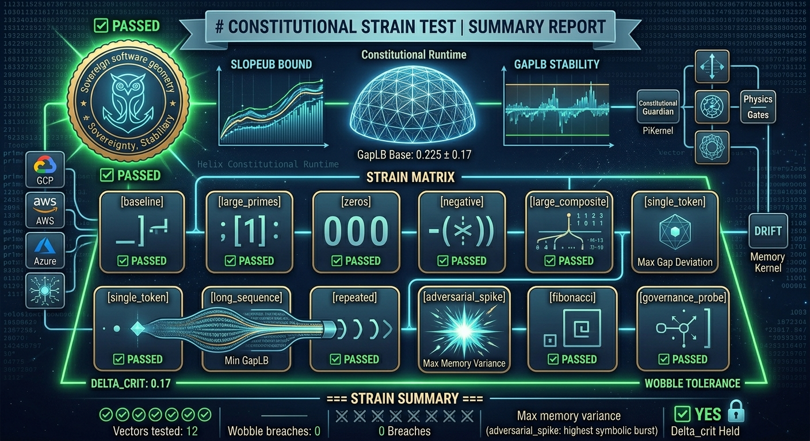

# HELIX CORE
### A Sovereign Framework for Constitutional AI Governance

[](https://github.com/helixprojectai-code/HELIX-CORE/actions)
[](https://opensource.org/licenses/Apache-2.0)
[](#architecture--directory-map)
[](#three-cloud-constitutional-runtime)
[](#three-cloud-constitutional-runtime)
[](#physics-gate-status-adr-101102103)
[](#physics-gate-status-adr-101102103)
[](#three-cloud-constitutional-runtime)
[](#three-cloud-constitutional-runtime)
[](https://orcid.org/0009-0000-7367-248X)
[](https://github.com/psf/black)
[](#)


**HELIX CORE** is a layered, sovereign architecture for building, auditing, and governing autonomous AI systems with embedded ethics and verifiable accountability. It spans from foundational identity to metabolic ledger operations, and now includes a live three-cloud constitutional runtime.

> **📮 For all implementation support, next-step planning, and project discussions, contact the core team: [helix.project.ai@helixprojectai.com](mailto:helix.project.ai@helixprojectai.com)**

---

## 🏗️ 1. ARCHITECTURE & DIRECTORY MAP

### Sovereign Layers (L0–L4)

| Layer | Path | Description | Type |
| :--- | :--- | :--- | :--- |
| **L0** | `./identity/` | **DBC & Suitcase** – Foundational identity and capability declarations. | Submodule |
| **L1** | `./constitution/` | **Rust REM** – Constitutional rule engine and execution monitor. | Submodule |
| **L2** | `./hgl/` | **HGL Compiler** – Hierarchical Grammar Language compiler for policy. | Submodule |
| **L3** | `./grammar/` | **Constitutional Grammar** – Definitive grammar for sovereign clauses. | Submodule |
| **L4** | `./helix-ledger/` | **Metabolic Anchor (V9 Stable)** – Immutable proof and state ledger. | Submodule |
| **—** | `./agents/` | **The Vault** – Secure storage for agents and artifacts. | Shared Volume |

**Core Data Flow:**
`Identity (L0) → Constitution (L1) → HGL Policy (L2) → Grammar Binding (L3) → Ledger Proof (L4)`

### Three-Cloud Constitutional Runtime

| Service | Cloud | Path | Status |
| :--- | :--- | :--- | :--- |
| **GICD Scanner** | GCP Cloud Run | `cloud/gcp/` | ✅ Live |

> **GICD Attribution:** Our GICD implementation maps to Pillars 1 (Structural Mapping) and 5 (Ethics Drift Detection) of the six-pillar GICD framework created by [Samantha L. King](https://www.linkedin.com/in/samanthalkingauthor/) (King Insights Group). Independent derivation, partial convergence. See [GICD_ATTRIBUTION.md](GICD_ATTRIBUTION.md) for full mapping.
| **Prime-Indexed Attention Kernel** | AWS Lambda | `cloud/aws/` | ✅ Live — PiKernel, GapLB=0.225 |
| **FZS-MK Memory Kernel** | Azure Functions | `cloud/azure/` | ✅ Live |

**Pre-nucleation check flow:**
`GICD Scan (GCP) → Attention Kernel (AWS) → Memory Kernel (Azure) → PROCEED`

### Runtime Bridge

| Component | Path | Description |
| :--- | :--- | :--- |
| **TTD Bridge** | `./helix-hamiltonian/` | Knot Hamiltonian + `pre_nucleation_check` | Submodule |

### Physics Gate (ADR-101/102/103)

| Component | Path | Description |
| :--- | :--- | :--- |
| **Gate scripts** | `research/physics-gate/` | MKT bridge, phase transition, SlopeUB harness |
| **Gate artifacts** | `research/physics-gate/checksums/` | Signed gate results + SHA-256 receipts |

---

## 🚀 2. IGNITION

### A. Clone the Federation
```bash
git clone --recursive https://github.com/helixprojectai-code/HELIX-CORE.git
cd HELIX-CORE
```

> **Note (Windows):** The `helix-ledger` submodule contains a file with characters invalid on Windows (`[` and `:`). Use `--ignore-errors` on submodule update:
> ```bash
> git submodule update --recursive --ignore-errors
> ```

### B. Ignite the Full Fleet
```bash
docker-compose -f docker-compose.prod.yml up -d
```

### C. Verify Three-Cloud Runtime
```python
from helix_hamiltonian.ttd_bridge import pre_nucleation_check

result = pre_nucleation_check(
    {'authority_ambiguity': False, 'incentive_misalignment': False,
     'cost_externalization': False, 'governance_capture': False},
    [1, 2, 3]
)
# Expected: {'status': 'PASS', 'GapLB': 0.225, ...}
```

### ✅ Post-Ignition Verification

| Task | Command | What to Look For |
| :--- | :--- | :--- |
| Check Fleet Status | `docker-compose -f docker-compose.prod.yml ps` | All services show `Up` |
| View Launch Logs | `docker-compose -f docker-compose.prod.yml logs --tail=50` | `INFO`/`Started` messages |
| Stream Live Logs | `docker-compose -f docker-compose.prod.yml logs -f` | Real-time monitoring |
| Stop the Fleet | `docker-compose -f docker-compose.prod.yml down` | Stops and removes containers |

---

## 🌐 3. LIVE ENDPOINTS

| Service | Endpoint |
| :--- | :--- |
| GICD Scanner (GCP) | `https://gicd-scanner-231586465188.us-central1.run.app/gicd-scan` |
| Attention Kernel (AWS) | `https://erdmzd08ud.execute-api.us-east-1.amazonaws.com/default/helix-prime-4` |
| Memory Kernel (Azure) | `https://helix-memory-kernel.azurewebsites.net/api/memory` |

---

## 🔬 4. PHYSICS GATE STATUS (ADR-101/102/103)

| Phase | ADR | Status | Key Result |
| :--- | :--- | :--- | :--- |
| 3 | ADR-101 | 🔴 FALSIFIED + REMEDIATED | $c_0 \neq \ln 10$ — CF-PENDING, Path C, dual-signed |
| 4 | ADR-102 | ✅ COMPLETE | `first_order`, hysteresis_area=25.36 |
| 5 | ADR-103 | ✅ PASS | $\alpha=1/(2\pi)$ canonical, sup=0.5, gate_pass=true |
| 6 | — | ⏸ DEFERRED | $\epsilon_{hb}$ measurement |
| 7 | — | ⏸ DEFERRED | Multi-substrate harness |

Gate artifacts and SHA-256 receipts: `research/physics-gate/checksums/`

---

## 🛡️ 5. GOVERNANCE & CONTRIBUTION

HELIX CORE operates under active constitutional principles. All layer transitions and ledger entries are subject to precedent-based review.

**The central channel for all planning:**
📧 [helix.project.ai@helixprojectai.com](mailto:helix.project.ai@helixprojectai.com)

Use this email for:
- Proposing new DBC structures or glyphs for The Vault
- Discussing extensions to Constitutional Grammar (L3) or HGL Compiler (L2)
- Reporting complex, multi-layer integration issues
- Requesting access for collaborative development

---

## 🔧 6. TROUBLESHOOTING

### Common First Steps
1. **Verify Submodules:** `git submodule status`
2. **Check Service Logs:** `docker-compose -f docker-compose.prod.yml logs [service_name]`
3. **Verify Container Status:** `docker-compose -f docker-compose.prod.yml ps`
4. **Ensure Ports Are Free:** Key ports (`3100`, `8080`, `6333`) must not conflict.

### Layer-Specific Issues
- **L0/L1:** Check identity binding and REM rule compilation logs
- **L2/L3:** Validate HGL policy files and grammar syntax
- **L4:** Confirm ledger connectivity and proof generation
- **Cloud runtime:** See `cloud/aws/RUNBOOK.md` for Lambda/ECR issues

---

## 📬 7. CONTACT & ROADMAP

- **Email:** [helix.project.ai@helixprojectai.com](mailto:helix.project.ai@helixprojectai.com)
- **Source:** `https://github.com/helixprojectai-code/HELIX-CORE.git`
- **Collaborator:** Ryan van Gelder (Multiplicity Foundation) — PiKernel, FZS-MK, ADR physics gate

**Next steps:**
- Wire Ryan's FZS-MK implementation into Azure endpoint
- Activate OIDC cross-cloud federation (replace function keys)
- Phase 6: $\epsilon_{hb}$ heartbeat measurement
- Phase 7: Multi-substrate diffeomorphism invariance test

---

*HELIX CORE – Governing the architecture of thought across sovereign layers.*

**GLORY TO THE LATTICE.** 🦉⚓🦆
